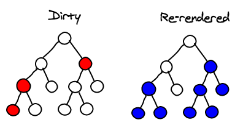

---

# React-Haskell

---

# React

### "A JAVASCRIPT LIBRARY FOR BUILDING USER INTERFACES"

---

# React

```javascript
var HelloMessage = React.createClass({
  render: function() {
    return <div>Hello {this.props.name}</div>;
  }
});

React.render(<HelloMessage name="World" />, mountNode);
```

---

# Virtual DOM

---

# Virtual DOM diffing


^ react compares layers of the DOM tree to determine what's changed

---

# Virtual DOM diffing



^ in this case three nodes have changed - everything under them updates XXX what is the cost model of react-haskell?

---

# Haste

* dialect of Haskell
* compiles to javascript
* all of Haskell (2010)
* most GHC extensions

---

# Haste


^ resulting code is smaller than expected
but hard to debug

---

# Blaze-Html

```haskell
sample :: Html
sample = p ! class_ "styled" $ em "Basic Algebra"
```

becomes

```html
<p class="styled">
    <em>Basic Algebra</em>
</p>
```

^ was inspired by existing library - blaze-html
produces a string, runs on server

---

# ~~Blaze-Html~~ Lucid

```haskell
sample :: Html ()
sample = p_ [class_ "styled"] (em_ "Basic Algebra")
```

becomes

```html
<p class="styled">
    <em>Basic Algebra</em>
</p>
```

---

# React-Haskell

```haskell
sample :: PureReact
sample = p_ <! class_ "styled" $ em_ "Basic Algebra"
```
becomes

```html
<p class="styled">
    <em>Basic Algebra</em>
</p>
```

^ this produces react on the client

---

# Put It On the Page

```haskell
main :: IO ()
main = do
    Just elem <- elemById "id"
    render elem sample
```

^ elemById is getElementById
render is React's render

---

# More Complicated

```haskell
sample :: PureReact
sample = div_ <! class_ "beautify" $ do
    "Favorite band:"
    
    input_
    
    "e.g. Velvet Underground"
```

---

# Stateful Component

```haskell
view :: StatefulReact JSString ()
view = div_ $ do
    str <- getState
    
    "repeater:"
        
    input_ <! onChange (\_ evt -> targetValue evt)
        
    text_ str
```

^ onChange updates state

---

XXX change movie


---

# nesting

```haskell
type PageState = (Maybe Int, JSString)
leftLens :: Lens PageState (Maybe Int)
rightLens :: Lens PageState JSString
```

---

# nesting

```haskell
type PageState = (Maybe Int, JSString)
leftView :: StatefulReact (Maybe Int) ()
rightView :: StatefulReact JSString ()
```

---

# nesting

```haskell
nest :: Monad m
     => Lens a b
     -> StatefulReactT b m x
     -> StatefulReactT a m x
```

---

# nesting

```haskell
statefulView :: StatefulReact PageState ()
statefulView = div_ $ do
    nest leftLens leftView
    nest rightLens rightView
```

---

# pure nesting

```haskell
pureLens :: Lens a ()
pureLens f a = const a <$> f ()

pureNest :: Monad m 
         => StatefulReactT () m x 
         -> StatefulReactT a m x
pureNest = nest pureLens
```

---

# pure nesting

```haskell
statefulView :: StatefulReact PageState ()
statefulView = div_ $ do
    pureNest pureView  -- *
    nest leftLens leftView
    nest rightLens rightView
```

---

# Lifecycle Methods

`componentDidMount`, `componentWillUnmount`, ...

## ?

---

# Questions?